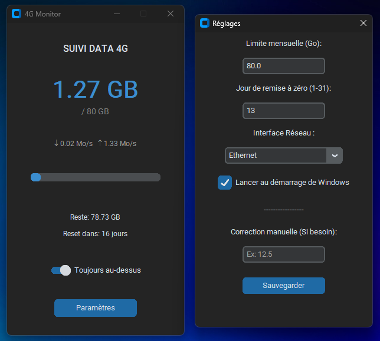

# 4G Monitor

**4G Monitor** est un utilitaire léger conçu pour Windows permettant de surveiller en temps réel la consommation de données (Data Usage), spécifiquement optimisé pour les forfaits limités (4G/5G, Hotspots).



## Fonctionnalités Principales

*   **Surveillance en Temps Réel** : Affichage instantané des débits montants (Upload) et descendants (Download).
*   **Gestion de Quota Mensuel** : Suivi précis de la consommation par rapport à une limite définie (ex: 50 Go).
*   **Distinction LAN/WAN** : Possibilité de sélectionner une interface réseau spécifique (Wi-Fi, Ethernet...) pour exclure le trafic local (NAS, Streaming local) du calcul.
*   **Persistance Intelligente** : Sauvegarde automatique de la consommation et restauration d'état après redémarrage.
*   **Alertes Visuelles** : Code couleur dynamique (Bleu > Orange > Rouge) indiquant la progression vers la limite du forfait.
*   **Mode Compact** : Fonction "Toujours au-dessus" (Always on Top) pour garder l'information visible sans gêner le travail.
*   **Démarrage Automatique** : Intégration optionnelle au démarrage de Windows.

## Installation

### Prérequis
- Python 3.x installé sur la machine.

### Mise en place
1.  Clonez ce dépôt ou téléchargez les fichiers.
2.  Installez les dépendances nécessaires via la commande :
    ```bash
    pip install -r requirements.txt
    ```
3.  Lancez l'application en double-cliquant sur `4G_Monitor.pyw` (exécution silencieuse sans console).

## Configuration Recommandée

Lors du premier lancement, il est conseillé de se rendre dans le menu **Paramètres** pour :
1.  **Sélectionner l'interface réseau** correspondant à votre connexion Internet (ex: *Wi-Fi*) afin d'éviter de comptabiliser les transferts de fichiers locaux.
2.  Définir votre **limite mensuelle** (en Go) et le **jour de remise à zéro** de votre forfait.
3.  Si nécessaire, utiliser la **Correction Manuelle** pour synchroniser le compteur avec votre consommation réelle actuelle.

## Crédits

Conçu et développé par Obat.
*Codé avec l'assistance d'une Intelligence Artificielle.*

## Licence

Ce projet est distribué sous la licence **AGPL-3.0**.
